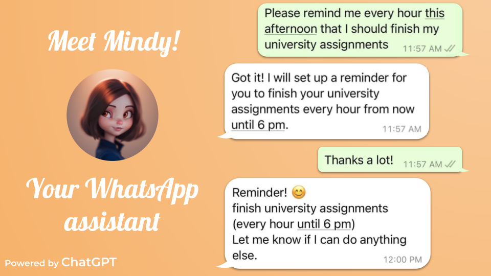

# Who is Mindy?
[https://mindyreminders.com](https://mindyreminders.com)

Mindy sends you reminders on WhatsApp, she's basically a second mom except you don't need to call her.

You can ask her "remind me to finish my assignment tonight” 👨‍💻 or "remind me to do 314 pull ups every 3rd friday of the month" 🏋️ and she'll make sure you don't forget!

Nobody has time to set reminders. With Mindy, it's as simple as sending a text.

# Code overview
Mindy runs on a lambda function. The entrypoint is `lambda_function.py`. The request is passed to the handler named `lambda_handler`.

When a user sends a message, WhatsApp forwards it to the Lambda function, which treats it and sends a message back to the user via the WhatsApp API.

For reminders, Amazon EventBridge sends a request to the lambda function every 5 minutes to check for reminders. All events found within a 5 minute window are sent in order.

`reminders` is a custom package with util functions for dynamodb, openai, whatsapp and time conversions.

# How to contribute?
However you want. Deployments are ad-hoc, DMs are open on [https://x.com/timothydelille](https://x.com/timothydelille).